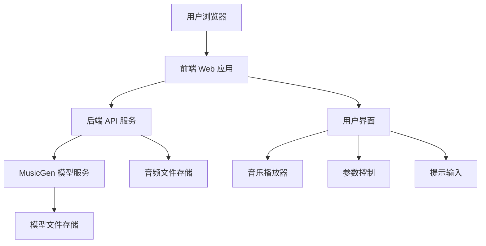

# 设计文档：本地音乐生成器

## 概述

本地音乐生成器是一个网页应用程序，它利用本地部署的 Facebook MusicGen-small 模型来生成音乐。该应用程序提供了一个具有苹果风格设计美学的用户界面，允许用户通过文本提示和参数控制来生成、播放和管理自定义音乐。

## 架构

应用程序采用前后端分离的架构，但两者都在本地运行：



### 主要组件

1. **前端 Web 应用**：使用现代前端框架（如 React）构建的单页应用程序，提供用户界面和客户端功能。
2. **后端 API 服务**：使用 Python 构建的本地 API 服务，处理与模型的交互和音频文件管理。
3. **MusicGen 模型服务**：封装 Facebook MusicGen-small 模型的服务层，处理模型加载和推理。
4. **模型文件存储**：存储模型文件和相关资源的本地存储。
5. **音频文件存储**：存储生成的音频文件的本地存储。
6. **用户界面**：具有苹果风格设计的用户界面组件。
7. **音乐播放器**：处理音频播放和控制的组件。
8. **参数控制**：允许用户调整音乐生成参数的组件。
9. **提示输入**：允许用户输入文本提示的组件。

## 组件和接口

### 前端组件

#### 1. 应用容器 (App Container)

- 负责整体布局和状态管理
- 管理全局应用状态
- 处理路由和视图切换

#### 2. 提示输入组件 (Prompt Input)

- 提供文本输入区域，用于接收用户的音乐生成提示
- 包含提交按钮和清除按钮
- 支持提示历史记录和建议

#### 3. 参数控制面板 (Parameter Controls)

- 提供各种参数控制，如：
  - 音乐长度滑块（5秒至30秒）
  - 音乐风格选择器（流行、古典、电子等）
  - 高级参数折叠面板（温度、采样率等）
- 所有控件遵循苹果设计风格

#### 4. 生成状态指示器 (Generation Status)

- 显示音乐生成的进度
- 提供取消生成的选项
- 显示估计完成时间
- 使用精美的动画效果

#### 5. 音乐播放器 (Music Player)

- 提供标准播放控件（播放、暂停、停止）
- 显示音频波形可视化
- 提供音量控制和进度条
- 支持循环播放选项

#### 6. 音乐库 (Music Library)

- 显示用户生成的音乐历史
- 允许为音乐添加标题和描述
- 提供下载和删除选项
- 支持按创建日期和标题排序

#### 7. 系统状态面板 (System Status)

- 显示模型加载状态
- 显示系统资源使用情况（内存、CPU/GPU）
- 提供系统设置选项

### 后端组件

#### 1. API 服务器 (API Server)

- 提供 RESTful API 端点
- 处理前端请求
- 管理与模型服务的通信
- 处理错误和异常

#### 2. 模型管理器 (Model Manager)

- 负责模型的加载和初始化
- 管理模型资源
- 处理模型版本和更新
- 提供模型状态信息

#### 3. 推理引擎 (Inference Engine)

- 执行模型推理
- 处理输入提示和参数
- 生成音频输出
- 优化性能和资源使用

#### 4. 音频处理器 (Audio Processor)

- 处理生成的原始音频数据
- 转换为不同的音频格式
- 应用后处理效果（如有需要）
- 管理音频文件存储

#### 5. 资源监控器 (Resource Monitor)

- 监控系统资源使用情况
- 提供资源使用统计
- 在资源不足时发出警告
- 优化资源分配

### API 接口

#### 1. 模型管理 API

- `GET /api/model/status` - 获取模型状态
- `POST /api/model/load` - 加载模型
- `POST /api/model/unload` - 卸载模型

#### 2. 音乐生成 API

- `POST /api/generate` - 生成音乐
  - 请求体：
    ```json
    {
      "prompt": "轻松的钢琴音乐，带有柔和的弦乐伴奏",
      "duration": 15,
      "style": "classical",
      "parameters": {
        "temperature": 0.8,
        "sample_rate": 44100
      }
    }
    ```
  - 响应：
    ```json
    {
      "id": "gen_12345",
      "status": "processing",
      "estimated_time": 10
    }
    ```

- `GET /api/generate/{id}/status` - 获取生成状态
- `GET /api/generate/{id}/result` - 获取生成结果

#### 3. 音频管理 API

- `GET /api/audio/list` - 获取音频列表
- `GET /api/audio/{id}` - 获取特定音频
- `DELETE /api/audio/{id}` - 删除音频
- `PUT /api/audio/{id}/metadata` - 更新音频元数据

#### 4. 系统 API

- `GET /api/system/resources` - 获取系统资源使用情况
- `GET /api/system/settings` - 获取系统设置
- `PUT /api/system/settings` - 更新系统设置

## 数据模型

### 1. 音频项 (AudioItem)

```typescript
interface AudioItem {
  id: string;              // 唯一标识符
  title: string;           // 音频标题
  description: string;     // 音频描述
  prompt: string;          // 生成提示
  parameters: {            // 生成参数
    duration: number;      // 持续时间（秒）
    style: string;         // 音乐风格
    temperature: number;   // 生成温度
    sample_rate: number;   // 采样率
    [key: string]: any;    // 其他参数
  };
  created_at: string;      // 创建时间
  file_path: string;       // 文件路径
  file_size: number;       // 文件大小
  duration: number;        // 实际持续时间
  format: string;          // 文件格式
}
```

### 2. 生成任务 (GenerationTask)

```typescript
interface GenerationTask {
  id: string;              // 任务ID
  status: 'pending' | 'processing' | 'completed' | 'failed';  // 任务状态
  prompt: string;          // 生成提示
  parameters: {            // 生成参数
    [key: string]: any;
  };
  progress: number;        // 进度（0-100）
  estimated_time: number;  // 估计完成时间（秒）
  result_id?: string;      // 结果音频ID
  error?: string;          // 错误信息
  created_at: string;      // 创建时间
  updated_at: string;      // 更新时间
}
```

### 3. 系统设置 (SystemSettings)

```typescript
interface SystemSettings {
  model: {
    version: string;       // 模型版本
    auto_load: boolean;    // 自动加载模型
    use_gpu: boolean;      // 使用GPU
  };
  audio: {
    default_format: string;  // 默认音频格式
    max_duration: number;    // 最大持续时间
    sample_rate: number;     // 默认采样率
  };
  ui: {
    theme: 'light' | 'dark' | 'system';  // UI主题
    animations: boolean;     // 启用动画
    history_size: number;    // 历史记录大小
  };
  system: {
    max_memory_usage: number;  // 最大内存使用量
    temp_directory: string;    // 临时目录
    log_level: 'debug' | 'info' | 'warning' | 'error';  // 日志级别
  };
}
```

### 4. 系统资源 (SystemResources)

```typescript
interface SystemResources {
  cpu: {
    usage: number;         // CPU使用率（0-100）
    cores: number;         // CPU核心数
  };
  memory: {
    total: number;         // 总内存（MB）
    used: number;          // 已用内存（MB）
    free: number;          // 可用内存（MB）
  };
  gpu?: {
    name: string;          // GPU名称
    memory_total: number;  // GPU总内存（MB）
    memory_used: number;   // GPU已用内存（MB）
    utilization: number;   // GPU利用率（0-100）
  };
  disk: {
    total: number;         // 总磁盘空间（MB）
    used: number;          // 已用磁盘空间（MB）
    free: number;          // 可用磁盘空间（MB）
  };
}
```

## 错误处理

应用程序实现了全面的错误处理策略，包括：

### 1. 前端错误处理

- 使用全局错误边界捕获React组件错误
- 实现API请求错误处理和重试机制
- 提供用户友好的错误消息和建议
- 记录客户端错误日志

### 2. 后端错误处理

- 实现结构化错误响应格式
- 使用HTTP状态码正确表示错误类型
- 记录详细的服务器错误日志
- 实现优雅的降级策略

### 3. 模型错误处理

- 捕获和处理模型加载错误
- 处理推理过程中的异常
- 提供模型特定的错误诊断
- 实现模型重新加载和恢复机制

### 4. 错误响应格式

```json
{
  "error": {
    "code": "MODEL_LOAD_FAILED",
    "message": "无法加载模型，请检查系统资源",
    "details": "CUDA out of memory",
    "suggestion": "尝试关闭其他应用程序或减少模型大小",
    "timestamp": "2023-07-17T12:34:56Z"
  }
}
```

## 测试策略

### 1. 单元测试

- 前端组件测试
- API端点测试
- 模型管理器测试
- 数据模型验证测试

### 2. 集成测试

- 前后端集成测试
- 模型集成测试
- 音频处理流程测试

### 3. 端到端测试

- 完整用户流程测试
- 性能和负载测试
- 错误恢复测试

### 4. 用户界面测试

- 响应式设计测试
- 可访问性测试
- 浏览器兼容性测试

## 技术栈

### 前端

- **框架**：React.js
- **状态管理**：Redux或Context API
- **样式**：Styled Components或Tailwind CSS
- **UI组件**：自定义组件，遵循苹果设计风格
- **音频处理**：Web Audio API
- **HTTP客户端**：Axios或Fetch API

### 后端

- **语言**：Python
- **Web框架**：FastAPI
- **模型集成**：Transformers库
- **音频处理**：librosa, pydub
- **并发处理**：asyncio

### 模型

- **模型**：Facebook MusicGen-small
- **框架**：PyTorch
- **推理优化**：ONNX Runtime（可选）

### 存储

- **音频文件**：本地文件系统
- **元数据**：SQLite或JSON文件
- **模型文件**：本地文件系统

## 部署考虑

### 本地部署

- 提供简单的安装脚本
- 自动依赖管理
- 支持不同操作系统（Windows, macOS, Linux）
- 最小化外部依赖

### 资源要求

- **最低要求**：
  - CPU：4核
  - 内存：8GB
  - 磁盘：5GB
  - GPU：可选，但推荐用于更快的推理

- **推荐要求**：
  - CPU：8核
  - 内存：16GB
  - 磁盘：10GB
  - GPU：NVIDIA GPU，至少6GB VRAM

### 安装流程

1. 下载安装包或克隆代码库
2. 安装Python依赖
3. 下载模型文件（首次运行时自动下载）
4. 启动本地服务器
5. 在浏览器中访问应用程序